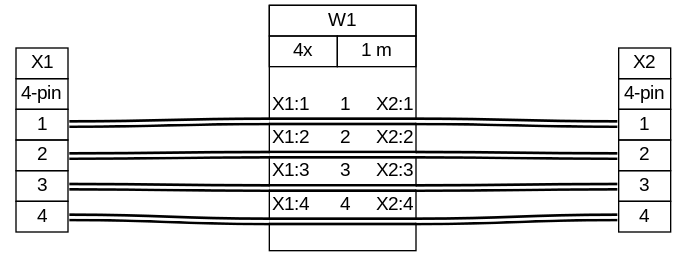

==================
Bare-bones example
==================

Consider a simple harness composed of two connectors and one cable. In this example, we define two connectors: ``X1`` and ``X2`` with 4 pins each. We then define a cable ``W1`` with 4 wires and a length of 1 m.

.. literalinclude:: tutorial-01.yml
   :language: yaml

The connections block describes how the pins of the connectors are connected together. In this example we have only one connection set. Each connection set is composed of at least two components: one connector and one wire. In this case we have one connector (``X1``), one wire (``W1``) and another connector (``X2``).

To connect the connectors together with a wire, the pins of the first connector ``X1`` are listed (the notation ``1-4`` is expanded by WireViz to the list ``[1, 2, 3, 4]``), then the wires in the cable are listed and finally the pins of the other connector are listed.

The first pin of ``X1`` is connected to the first wire of ``W1`` and the first wire of ``W1`` is connected to the first pin of ``X2``.

Output

`Source <tutorial-01.yml>`__ - `Bill Of Materials <tutorial-01.bom.tsv>`__

In the next tutorial we'll add some colour and change the order of the wires.
