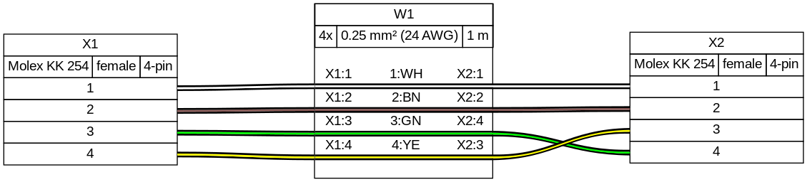

============================
Adding parameters and colors
============================

Connectors can be described with parameters. We can add the ``type`` parameter to uniquely identify the connector family or a ``subtype`` to specify the gender of the connector for example. This information will be included in the generated result.

Similarly, we can describe the cables with properties like the wire guauge or the colour of the individual conductors.

For a full list of properties that can be set on connectors and cables see the `harness syntax <../..syntax.md>`__.

.. literalinclude:: tutorial-02.yml
   :language: yaml

To describe the colours of each conductor, we add a ``colors`` key to the ``cable``. This list should contain as many entries as there are wires in the cable (as specified by the ``wirecount``).

See `Color List <../../syntax.html#colors>`__ for a full list of supported colours.

We can also change the connections between wires and pins on a connector. In the `previous example <../tutorial/01-bare-bones/tutorial-01.html>`__, the connections flowed, in the same order, from ``X1`` to ``X2``. In this example, we've changed the connection set so that the pins of ``X2`` are ``[1, 2, 4, 3]`` instead of ``[1, 2, 3, 4]``.

Output:

`Source <tutorial-02.yml>`__ - `Bill Of Materials <tutorial-02.bom.tsv>`__
